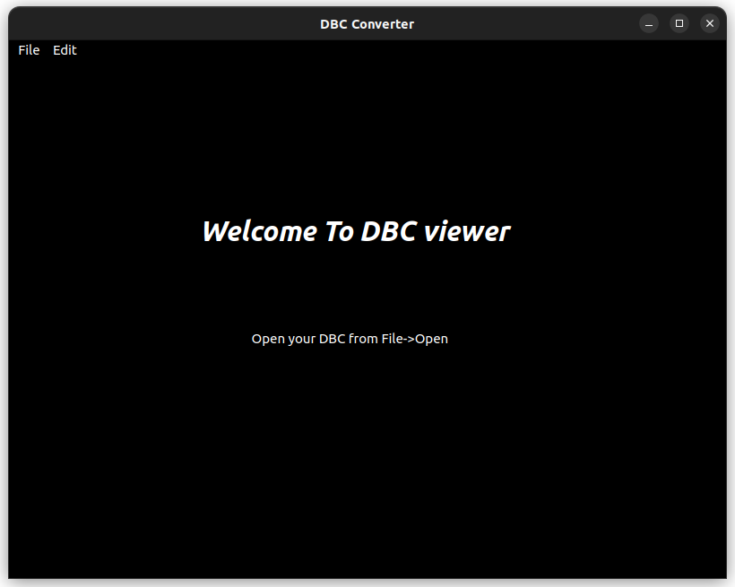
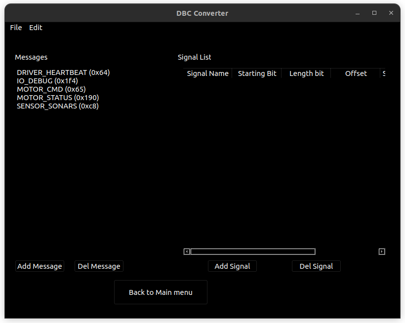

# CAN_BUS_DBC_VIEWER
The code is designed for a free CAN bus dbc viewer. 
Below is the process for using it. 
Start With Home Page 
 
Click File>Open Select your DBC 
If DBC is openable without errors you can easily view it

